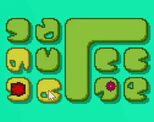

# Noneuclilypads
It's tough surviving the non-Euclidean marshlands. A roguelike with a broken grid, made for the [2019 GitHub Game-Off](https://itch.io/jam/game-off-2019/results).

## Featuring
- Semi-randomized lilypad islands, making the challenges unique yet still preserving some handcrafted design
- Simple yet surprisingly deep gameplay where you must think several moves ahead
- Graphics and sound design by yours truly

## To run this code, you'll need:
- Lua 5.3
- LOVE 11.3

## More GIFs
### Main Menu and Tutorial
The main menu is navigated just like a level is! The tutorial as well, but that's to be expected.

### Jumping Between Islands
It takes three turns to charge a jump, so make sure you're safe before you leap away.

